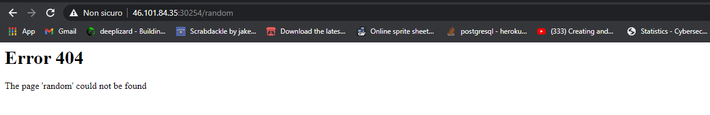
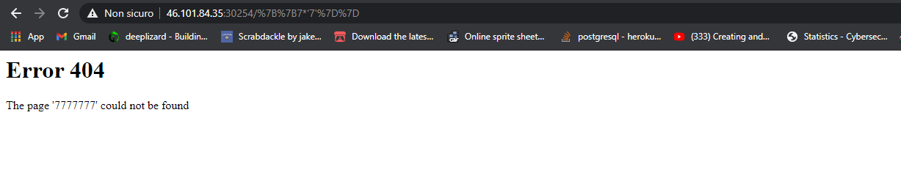
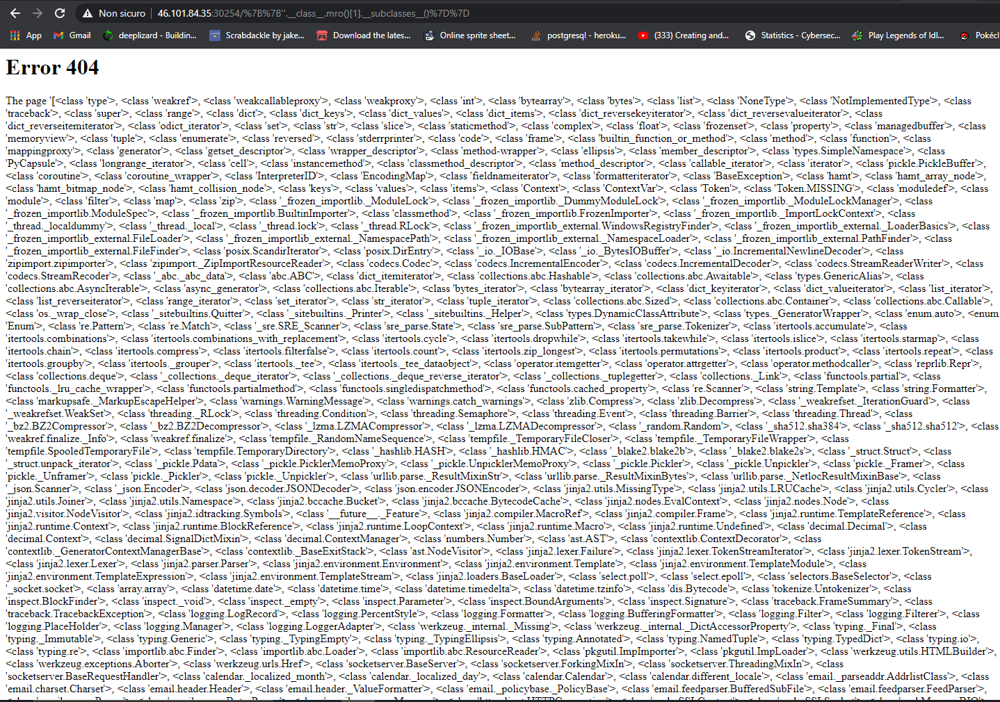
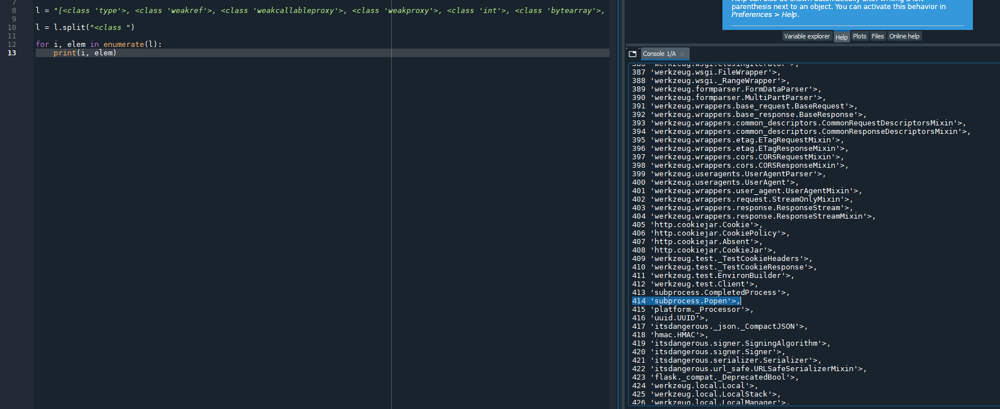
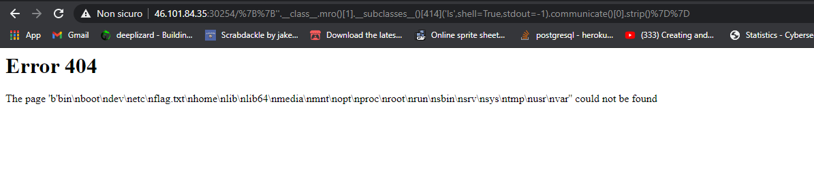
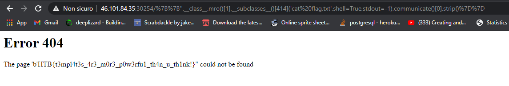
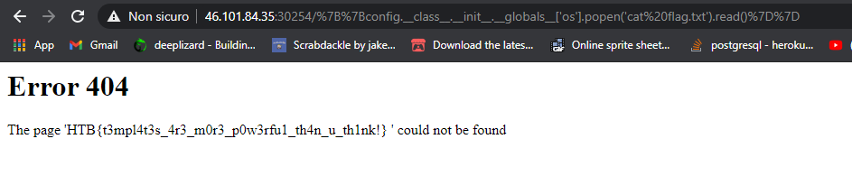

# __*Can you exploit this simple mistake?*__

 

The given url takes us to this main page. As we can see the author already gave us the infrastructure underneath the web page. 
__Flask/Jinja2__ is known to be vulnerable to a Server Side Template Injection (SSTI), as already the name of the challenge suggested. So let's go for this path.

First, we want to find where we can insert an input. Since there's no form, html input tag or anything else in the page, we can try in the url. It's common for the server to handle the 404 error page, so let's put a random path in the url.

 

Found. The server answer with an html page where the actual url we inserted is replicated. That's our input. To see if this is vulnerable to SSTI we can try some basic payloads:

 

To resume, we want to write something like this:
 
<http://remote_ip:port/{{template_payload}}>

Usually, the most difficult thing when trying to exploit a SSTI is to bypass the filters. After a couple of tries, we can easily conclude that the server has not filters to bypass, and displays our input without modification.

## __*Payload*__

Let's get into the payload. Since we don't know where the flag is, the easiest thing to do is to write a payload to execute some shell commands. We are particularly interested in __*ls*__ (to find the flag) and __*cat*__ (to print the flag). A common class to use is __*Popen*__. To get it we can use the string inheritance tree, just starting from an empty space '' (instance of string). 

__{{''.__class__.mro()[1].__subclasses__()}}__

 

Now that we have the list, we have to find __*Popen*__ in this hundreds of entries. A few rows of python will do the trick:

 

Our payload now will be something like this:

{{''.__class__.mro()[1].__subclasses__()\[414]('ls',shell=True,stdout=-1).communicate()[0].strip()}}

 

We printed the root path, and as we can see we already have here the flag in __*flag.txt*__ file. So let's print it. This is the final payload:

{{''.__class__.mro()[1].__subclasses__()[414]('cat flag.txt',shell=True,stdout=-1).communicate()[0].strip()}}

 

 
 
 
 

__N.B__
Just for the sake of completeness, this is not the only way to obtain the flag, nor even to obtain the __*Popen*__ class. Here's another working payload:

{{config.__class__.__init__.__globals__['os'].popen('cat flag.txt').read()}}

 

