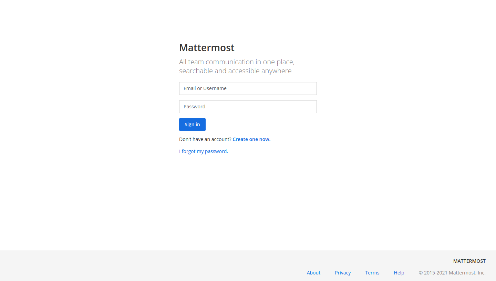
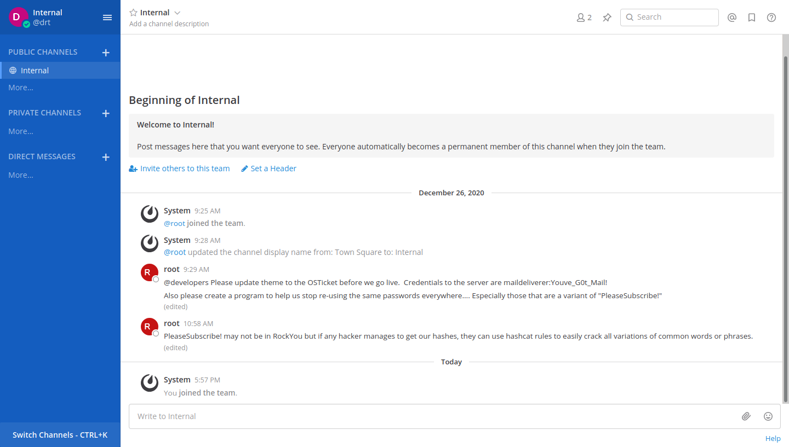
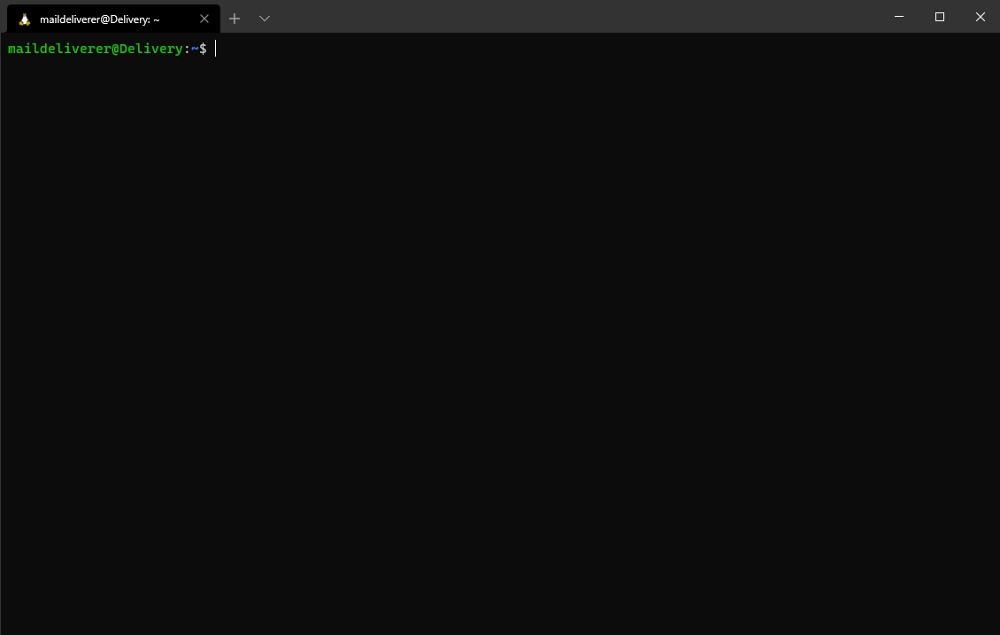

  
Table of content

  <ol>
    <li>
      <a href="#Enumeration">Enumeration</a>
    </li>
    <li>
      <a href="#/etc/hosts">/etc/hosts</a>
    </li>
    <li>
      <a href="#Exploiting HelpDesk">Exploiting HelpDesk</a>
    </li>
    <li>
      <a href="#MailDeliverer">MailDeliverer</a>
    </li>
    <li>
      <a href="#Hash">Hash</a>
    </li>
    <li>
      <a href="#Privilege esclation">Privilege esclation</a>
    </li>
  </ol>

## Enumeration

First of all we can try to enumerate all opened ports on the machine. To do this we can use NMAP.

Running 'nmap -sV 10.10.10.222' will give us the following result:

'''
Starting Nmap 7.80 ( https://nmap.org ) at 2021-02-25 15:58 CET
Nmap scan report for 10.10.10.222
Host is up (0.20s latency).
Not shown: 998 closed ports
PORT   STATE SERVICE VERSION
22/tcp open  ssh     OpenSSH 7.9p1 Debian 10+deb10u2 (protocol 2.0)
80/tcp open  http    nginx 1.14.2
Service Info: OS: Linux; CPE: cpe:/o:linux:linux_kernel
'''

As we can see we have two listening services:
  1. OpenSsh on port 22 (will see next)
  2. nginx on port 80

Due to a running instance of nginx we thought that a server are runnning on that port. We tryid to visit with browser http://<machine-ip>:80 and we reached a simple website 
  
  

"Contact Us" will prompt a window with some usefull information

   

## /etc/hosts

By inspecting this window we have gained some link, but bot are unreachable. So we thought to edit /etc/hosts file on our system in order to manyally seet entry in the dns resolve.

The first link reach a page with a login form. It's a Mattermost server. This is an opensource mailing service, probably running locally on the machine.

 

In the previous window there some hints (only @delivery.htb domain can register), so we can't use this form to access.

The second link will reach another page.

 

## Exploiting HelpDesk
Here we can rise a ticket. At the end of the procedure it says that we can contact the service with an email at "<ticket-number>@DELIVERY.HTB". This is a very important thing.
We tryied to use this email to register us to the mattermost server and boom, we are in!
  

In this chat there are a lot of usefull hints and a user to access trough ssh to the machine.

## Hash

In the home folder of the user we can find a file with containing an hash string (rabbit hole). Searching in the system we found that an istance of mysql server is on, but we dont have any credentials. Surfing on internet we found that a config file of mottermost can contain the credential of the db running in the beckend. That's it! We found the credential of the db in the confing file of mattermost server, we have connected to the mysql db and searched for credential. In this way we have gained the hash of root user's password. Following the hints in the mattermost chat we tryid to crack this hash with an hashcat rule attack (<a href="https://github.com/praetorian-inc/Hob0Rules">usefull repo</a>). 

## Privilege esclation

The result of this process will give the password for the root user and using maildeliverer account with ssh we can access trough root to the machine. In the home of root user we can found a file containing the flag

